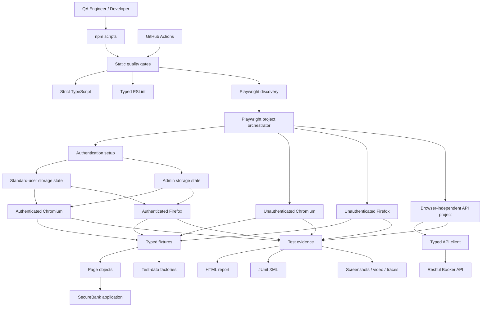
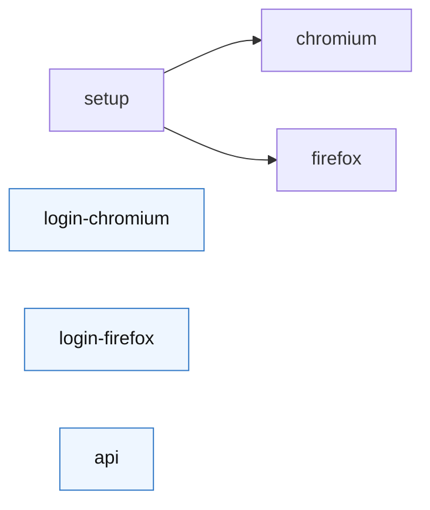
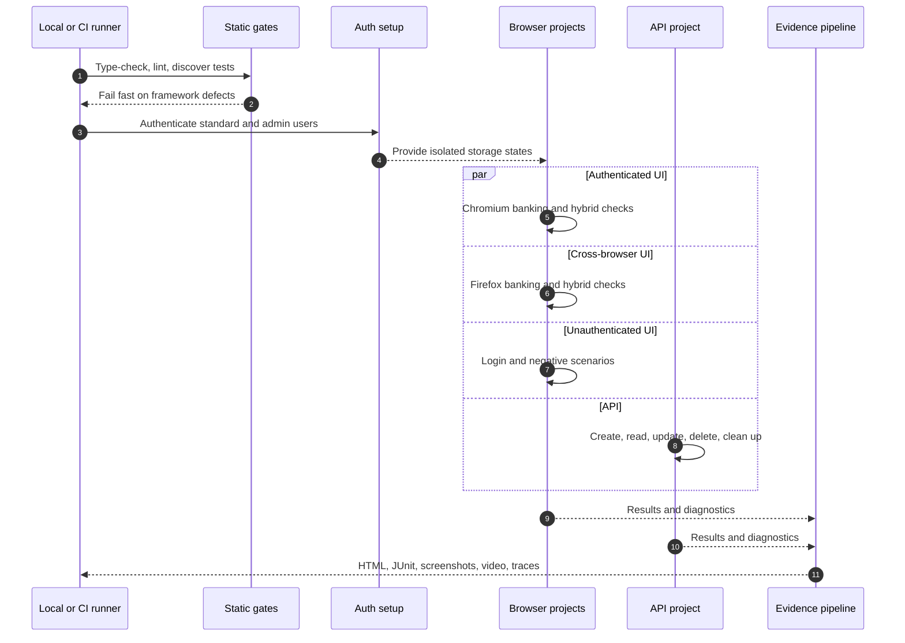
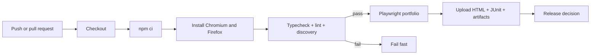

# SecureBank Quality Engineering Framework

[](https://github.com/HK1947/pw-bank-framework/actions/workflows/playwright.yml)


An enterprise-style Playwright and TypeScript framework demonstrating how a QA organization can build fast, reliable release confidence across browser UI, API, authentication, and client-state integration layers.

The framework tests the [SecureBank QA Playground](https://qaplayground.com/bank/) and the public Restful Booker API. Its architecture is intentionally designed to show more than test automation: it demonstrates risk-based coverage, test isolation, deterministic data management, secure configuration, failure diagnostics, and CI governance.

> **Validated baseline:** 51 project-expanded checks across Chromium, Firefox, unauthenticated login, authenticated banking flows, API CRUD, and hybrid integration—with strict TypeScript and ESLint gates before execution.

## Executive overview

| Quality capability | What the framework provides | Business value |
| --- | --- | --- |
| Release confidence | Smoke, regression, API, negative, and hybrid layers | Faster go/no-go decisions |
| Cross-browser assurance | Authenticated and unauthenticated coverage in Chromium and Firefox | Reduced browser-specific production risk |
| Test isolation | Dedicated setup, authenticated, login, and API projects | Fewer false failures and state leaks |
| Security hygiene | No committed environment files or reusable session state | Safer source control and CI operation |
| API confidence | Status validation, typed contracts, full CRUD, guaranteed cleanup | Earlier detection with lower execution cost |
| Maintainability | Typed fixtures, page objects, data factories, governed locators | Lower cost of change as coverage grows |
| Failure forensics | HTML, JUnit, screenshots, video, and retry traces | Shorter mean time to diagnose failures |
| Engineering governance | Type-check, lint, test discovery, branch CI, concurrency control | Consistent quality standards on every change |

## Architecture



### Why the projects are separated

Login tests must begin without a session. Dashboard and banking tests should not repeatedly pay the cost of logging in. API tests should not run once for every browser when browser behavior is irrelevant.

The framework encodes those rules directly in `playwright.config.ts`:



- `setup` creates fresh standard and admin authentication states.
- `chromium` and `firefox` consume those states and run authenticated UI/hybrid scenarios.
- `login-chromium` and `login-firefox` always use empty storage state.
- `api` runs browser-independent contract and lifecycle tests exactly once.

This prevents authenticated state from contaminating login tests and prevents API work from being duplicated across browser projects.

## Execution lifecycle



## Test portfolio

| Layer | Representative risks covered | Execution model |
| --- | --- | --- |
| Authentication | Valid roles, locked users, invalid password, empty credentials, unknown users | Empty browser state on Chromium and Firefox |
| Dashboard | Financial summary visibility, currency format, transaction integrity, navigation, logout | Reused authenticated state on both browsers |
| Banking guardrails | Missing transfer account, minimum amounts, bill-payment account and date validation | Authenticated UI on both browsers |
| Transactions | Search result accuracy and displayed financial amount | Authenticated UI on both browsers |
| API | Authentication, response status/schema, create/read/update/delete, cleanup | Dedicated browser-free project |
| Hybrid integration | Application-state mutation reflected in UI and restored after the test | Isolated browser context with `finally` cleanup |
| Authorization identity | Standard and admin storage states resolve to the correct user | Setup dependency plus per-test admin override |

## Repository structure

```text
pw-bank-framework/
├── .github/workflows/
│   └── playwright.yml          # CI quality gate and evidence publishing
├── auth/
│   └── auth.setup.ts           # Fresh standard/admin authentication states
├── fixtures/
│   └── test-fixtures.ts        # Typed page and API dependency injection
├── helpers/
│   ├── api-client.ts           # Status-aware, typed API abstraction
│   ├── data-factory.ts         # Valid, overrideable test data
│   ├── logger.ts               # Structured local diagnostics
│   └── smart-locator.ts        # Migration helper for legacy locators
├── pages/
│   ├── BasePage.ts
│   ├── LoginPage.ts
│   ├── DashboardPage.ts
│   ├── TransferPage.ts
│   ├── BillPayPage.ts
│   └── TransactionsPage.ts
├── tests/
│   ├── api/                    # Browser-independent API tests
│   ├── hybrid/                 # State-to-UI integration tests
│   ├── auth-check.spec.ts
│   ├── banking-flows.spec.ts
│   ├── dashboard.spec.ts
│   ├── login.spec.ts
│   └── smoke.spec.ts
├── types/                      # Shared domain contracts
├── .env.example               # Safe configuration template
├── eslint.config.mjs          # Type-aware lint rules
├── playwright.config.ts       # Project orchestration and diagnostics
└── tsconfig.json               # Strict compiler contract
```

Generated authentication states live under `playwright/.auth/`. Environment files, reports, videos, traces, and session states are deliberately excluded from Git.

## Quick start

### Prerequisites

- Node.js 20 or newer
- npm
- Chromium and Firefox installed by Playwright

### Install and configure

```bash
npm ci
npx playwright install chromium firefox
cp .env.example .env.qa
```

Update `.env.qa` with the QA environment values:

| Variable | Purpose |
| --- | --- |
| `BASE_URL` | SecureBank application root; normalized to a trailing slash by the framework |
| `STANDARD_USER` / `STANDARD_PASS` | Standard-user authentication setup |
| `ADMIN_USER` / `ADMIN_PASS` | Admin authentication and authorization checks |
| `API_BASE_URL` | Restful Booker service root |
| `API_USERNAME` / `API_PASSWORD` | API token acquisition |
| `ENV_NAME` | Human-readable environment label in test output |

Run the full local quality gate:

```bash
npm run check
npm test
```

## Commands

| Command | Purpose | Typical audience |
| --- | --- | --- |
| `npm test` | Execute the complete test portfolio | CI and release validation |
| `npm run test:smoke` | Run the smallest release-confidence suite | Deployment verification |
| `npm run test:regression` | Run tests outside the smoke slice | Scheduled and pre-release runs |
| `npm run test:api` | Execute the API project once, without browsers | Service/API engineers |
| `npm run test:headed` | Run with visible browsers | Local debugging |
| `npm run test:ui` | Open Playwright UI mode | Test development |
| `npm run test:debug` | Start the Playwright inspector | Root-cause analysis |
| `npm run test:flake` | Repeat every test three times | Reliability assessment |
| `npm run typecheck` | Validate strict TypeScript contracts | Pre-commit validation |
| `npm run lint` | Run type-aware lint rules | Code-quality validation |
| `npm run check` | Type-check, lint, and verify discovery | CI fail-fast gate |
| `npm run report` | Open the latest HTML report | Failure triage |

Tests can also be selected by tag:

```bash
npx playwright test --grep @login
npx playwright test --grep @negative
npx playwright test --grep @hybrid
```

## CI/CD quality gate



The workflow provides:

- Least-privilege `contents: read` permissions.
- One active run per branch/ref; superseded runs are cancelled.
- Deterministic installation through `npm ci`.
- Static quality gates before expensive browser execution.
- One retry in CI with a trace on the first retry.
- Screenshots and videos retained only for failures.
- HTML and JUnit output for human and machine consumers.
- Test evidence uploaded even when execution fails.
- Secret overrides for real environments, with public sandbox defaults only for the demo targets.

## Engineering standards

Every new test should follow these rules:

1. **Assert business outcomes.** Element presence alone is rarely sufficient.
2. **Start from an explicit state.** Use the correct authenticated or unauthenticated project.
3. **Prefer semantic locators or `data-testid`.** Avoid DOM-shape and styling selectors.
4. **Keep API work browser-independent.** Do not multiply service tests across browser projects.
5. **Create valid data.** Use `DataFactory` and override only fields relevant to the scenario.
6. **Guarantee cleanup.** Place deletion or state restoration in `finally`.
7. **Avoid fixed sleeps.** Use Playwright assertions and event-driven waiting.
8. **Make failures explain themselves.** Assertions should identify the violated business rule.
9. **Do not commit credentials or storage state.** Use local environment files and CI secrets.
10. **Pass `npm run check`.** Type, lint, and discovery failures are framework defects.

## Adding coverage

### UI scenario

1. Add or extend a page object under `pages/`.
2. Register it in `fixtures/test-fixtures.ts` when reuse provides value.
3. Put the spec in the appropriate domain file under `tests/`.
4. Choose authenticated or login-project execution intentionally.
5. Assert the user-visible and data-level result.

### API scenario

1. Add the operation and response contract to `ApiClient`.
2. Put the test under `tests/api/` so it runs only in the `api` project.
3. Validate status and meaningful response fields.
4. Clean up created resources in `finally`.

### New environment

Create `.env.<name>`, then run:

```bash
ENV=<name> npm test
```

The framework validates that `BASE_URL` exists and normalizes its trailing slash, preventing relative-navigation failures such as `/login` being resolved outside `/bank/`.

## Failure triage

Use this order to minimize diagnosis time:

1. **Static gate failure:** run `npm run typecheck` or `npm run lint` locally.
2. **Setup failure:** inspect authentication screenshots and trace first; dependent authenticated projects will be blocked intentionally.
3. **Single browser failure:** compare Chromium and Firefox evidence for a browser-specific defect.
4. **Cross-browser failure:** inspect shared page objects, data, environment health, and application behavior.
5. **API failure:** read the status-aware error, which includes URL, actual status, expected status, and response body.
6. **Flaky behavior:** run `npm run test:flake` and inspect the first-retry trace.

## Quality roadmap

The current framework is a strong production-style baseline. The next enterprise capabilities would be:

- Accessibility scanning with WCAG-focused release thresholds.
- Visual regression for high-value financial screens.
- CI sharding when execution volume justifies it.
- Historical flake and duration analytics.
- Test-management linkage to requirements and defects.
- Contract/schema validation generated from an API specification.
- Risk-based mobile/tablet projects for responsive banking flows.

## Current assessment

| Dimension | Rating | Rationale |
| --- | ---: | --- |
| Architecture | 9/10 | Explicit project boundaries, typed fixtures, reusable domain layers |
| Reliability | 9/10 | Isolated state, event-driven waits, cleanup, cross-browser validation |
| Maintainability | 8.5/10 | Strict typing, linting, page objects, factories, clear conventions |
| Test design | 8.5/10 | Business-focused UI, negative, API, and hybrid coverage |
| CI and diagnostics | 9/10 | Fail-fast gates plus rich evidence and concurrency control |
| Security hygiene | 8.5/10 | Generated secrets/state excluded; CI supports secret overrides |
| Enterprise scalability | 7.5/10 | Sharding, accessibility, visual, and analytics remain roadmap items |
| **Overall** | **8.5/10** | **Professional, credible, and ready to scale for the demo product** |

---

Built as a practical example of quality engineering as a system—not simply a collection of automated tests.
