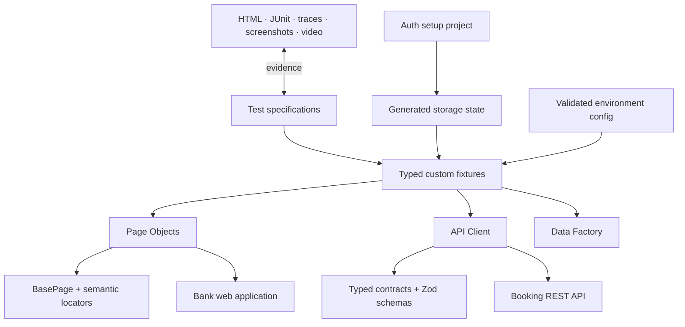
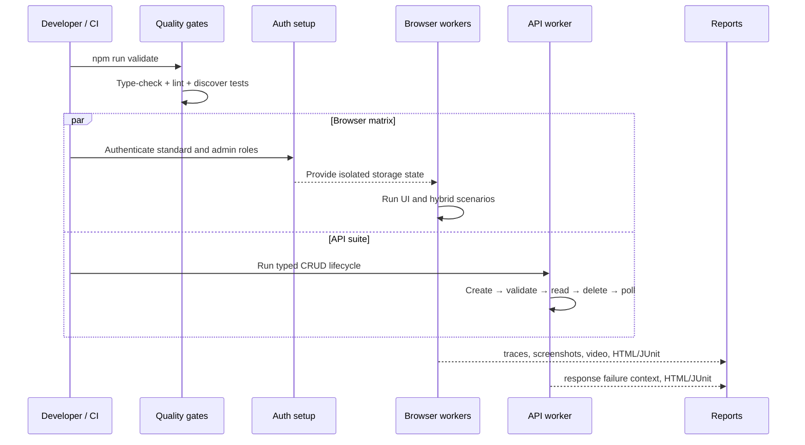
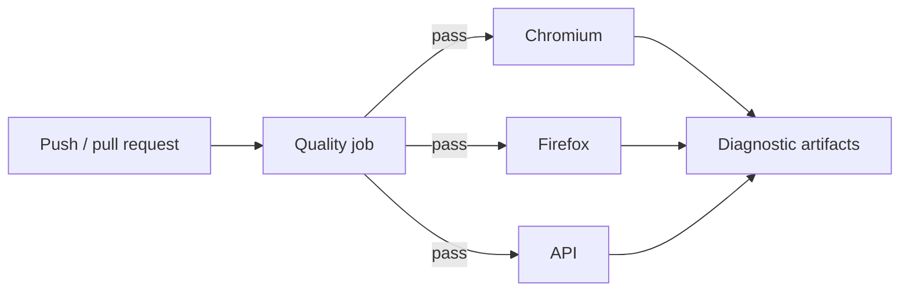

# Playwright Bank Automation Framework

[](https://github.com/HK1947/pw-bank-framework/actions/workflows/playwright.yml)
[](https://playwright.dev/)
[](https://www.typescriptlang.org/)

A production-style test automation framework demonstrating how a senior SDET can design one maintainable quality platform for **browser UI, REST API, and hybrid end-to-end testing**.

The framework tests a multi-role banking application and a booking API. Its purpose is not simply to collect test cases: it shows isolation, reusable domain abstractions, typed contracts, secure authentication state, cross-browser execution, deterministic cleanup, and CI diagnostics.

## What this framework demonstrates

- UI testing on Chromium and Firefox with Playwright web-first assertions
- API lifecycle testing with typed request/response models and Zod runtime validation
- Hybrid flows that combine API setup, browser actions, and storage verification
- Multi-role authentication generated once through a Playwright setup dependency
- Page Objects for user behaviour, custom fixtures for dependency injection
- Data factories for independent, repeatable test data
- Strict TypeScript, ESLint, test discovery, and execution as separate quality gates
- Failure evidence through HTML, JUnit, screenshots, video, and retry traces
- Local, CI, headed, debug, UI-mode, tag-based, and Docker execution

## Architecture


```mermaid
flowchart TB
    T["Test specifications"] --> F["Typed custom fixtures"]
    F --> P["Page Objects"]
    F --> A["API Client"]
    F --> D["Data Factory"]
    P --> B["BasePage + semantic locators"]
    A --> C["Typed contracts + Zod schemas"]
    P --> UI["Bank web application"]
    A --> API["Booking REST API"]
    S["Auth setup project"] --> ST["Generated storage state"]
    ST --> F
    E["Validated environment config"] --> F
    R["HTML · JUnit · traces · screenshots · video"] <-->|evidence| T
```

The dependency direction stays deliberate: tests express business intent, fixtures assemble dependencies, Page Objects/API clients hide transport details, and types validate the boundary.

```text
pw-bank-framework/
├── .github/workflows/     # parallel quality, browser, and API pipelines
├── auth/                  # setup tests; generated *.json stays untracked
├── config/                # validated environment configuration
├── fixtures/              # dependency injection for tests
├── helpers/               # API client, data factory, logger, locator utility
├── pages/                 # BasePage and business-facing Page Objects
├── tests/
│   ├── api/               # API contract and lifecycle tests
│   ├── hybrid/            # cross-layer scenarios
│   └── *.spec.ts          # login, dashboard, fixture, and smoke suites
├── types/                 # shared domain contracts
├── Dockerfile
├── eslint.config.mjs
├── playwright.config.ts
└── tsconfig.json
```

## Execution lifecycle


```mermaid
sequenceDiagram
    participant CI as Developer / CI
    participant Q as Quality gates
    participant S as Auth setup
    participant W as Browser workers
    participant A as API worker
    participant R as Reports

    CI->>Q: npm run validate
    Q->>Q: Type-check + lint + discover tests
    par Browser matrix
        CI->>S: Authenticate standard and admin roles
        S-->>W: Provide isolated storage state
        W->>W: Run UI and hybrid scenarios
    and API suite
        CI->>A: Run typed CRUD lifecycle
        A->>A: Create → validate → read → delete → poll
    end
    W-->>R: traces, screenshots, video, HTML/JUnit
    A-->>R: response failure context, HTML/JUnit
```

## Test strategy

| Layer | What is validated | Design choice |
|---|---|---|
| UI | login roles, negative authentication, dashboard, tables, navigation, logout | semantic/test-id locators and web-first assertions |
| API | authentication and complete booking CRUD lifecycle | typed client, runtime schemas, explicit status handling |
| Hybrid | API-created data and browser/local-storage behaviour | verifies integration boundaries without repeating UI setup |
| Contract | environment and API response shape | fail early with a readable configuration/schema error |
| Quality | every TypeScript source file and test registration | strict compiler and zero-warning lint gates |

Tests are independent and parallel-safe. Data created by a test is removed in `finally`, even when its verification fails. API and browser projects are separated so a third-party API incident is immediately distinguishable from a UI regression.

## Quick start

Requirements: Node.js 20+ and npm.

```bash
git clone https://github.com/HK1947/pw-bank-framework.git
cd pw-bank-framework
npm ci
npx playwright install --with-deps
cp .env.example .env.qa
# Replace placeholder passwords in .env.qa
npm run validate
npm test
```

Generated authentication files contain cookies and tokens. They are recreated by `auth/auth.setup.ts` and are intentionally excluded from Git.

## Common commands

| Command | Purpose |
|---|---|
| `npm test` | complete configured suite |
| `npm run test:ui` | Chromium and Firefox UI projects |
| `npm run test:api` | API project only |
| `npm run test:smoke` | Chromium smoke tests |
| `npm run test:headed` | visible Chromium execution |
| `npm run test:interactive` | Playwright UI mode |
| `npm run test:debug` | Playwright Inspector |
| `npm run validate` | strict TypeScript, ESLint, and test discovery |
| `npm run report` | open the last HTML report |

Run a tag or a single file:

```bash
npx playwright test --grep @negative --project=chromium
npx playwright test tests/dashboard.spec.ts --project=firefox
```

## Configuration and secrets

`config/environment.ts` validates configuration before execution. Use `.env.qa`, `.env.staging`, or CI environment variables; only `.env.example` is committed.

| Variable | Purpose |
|---|---|
| `ENV` | selects `.env.<name>`; defaults to `qa` |
| `BASE_URL` | banking UI base URL |
| `STANDARD_USER`, `STANDARD_PASS` | standard-role setup authentication |
| `ADMIN_USER`, `ADMIN_PASS` | admin-role setup authentication |
| `API_BASE_URL` | booking API root |
| `API_USERNAME`, `API_PASSWORD` | API token credentials |

For a real system, store passwords in GitHub Actions secrets or an enterprise secret manager. Never commit `.env.*` or `auth/*.json`.

## Why the key abstractions exist

**Page Objects** expose business operations and stable elements without putting assertions everywhere. Assertions remain visible in tests, so failures explain the expected behaviour.

**Fixtures** construct fresh dependencies per test. Tests request only what they use, which reduces setup duplication and keeps parallel execution isolated.

**API Client** owns URLs, authentication, headers, status handling, and runtime contract parsing. Tests remain focused on the booking lifecycle.

**Data Factory** generates independent domain data while accepting targeted overrides. This avoids shared test records and hard-coded collisions.

**Storage state** performs expensive UI authentication once per role and gives each worker a clean authenticated context. State files are build artifacts, not source code.

## CI/CD design


```mermaid
flowchart LR
    PR["Push / pull request"] --> Q["Quality job"]
    Q -->|pass| C["Chromium"]
    Q -->|pass| F["Firefox"]
    Q -->|pass| A["API"]
    C --> ART["Diagnostic artifacts"]
    F --> ART
    A --> ART
```

The workflow uses least-privilege repository permissions, cancels superseded runs, caches npm packages, executes browsers as a visible matrix, and uploads evidence even on failure. `fail-fast: false` preserves cross-browser evidence when one browser fails.

## Docker

```bash
docker build -t pw-bank-framework .
docker run --rm \
  -e BASE_URL=https://qaplayground.com/bank/ \
  -e STANDARD_PASS=bank_sauce \
  -e ADMIN_PASS=admin_sauce \
  -e API_PASSWORD=password123 \
  pw-bank-framework
```

Inject secrets at runtime; do not bake them into an image.

## Adding a new capability

1. Add or extend the domain contract in `types/`.
2. Add behaviour to a Page Object or the API client; keep assertions in the test.
3. Expose reusable setup through a typed fixture.
4. Generate unique data through `DataFactory`.
5. Write a focused scenario with cleanup and a meaningful tag.
6. Run `npm run validate`, then the smallest relevant project, then the full suite.

## Engineering decisions and boundaries

- Locator priority is test ID → accessible role/label → visible text → CSS as a last resort.
- Playwright assertions are preferred over returning booleans because they auto-retry and produce better diagnostics.
- Browser and API tests use real public demo systems. Their availability is outside this repository; CI separation makes such incidents diagnosable.
- Retries are enabled only in CI and traces are collected on the first retry, preventing local defects from being hidden.
- The framework deliberately avoids a large custom reporter; standard artifacts are easier for teams to maintain and integrate.

## Roadmap for an enterprise deployment

- Replace public demo targets with controlled test environments or service virtualization.
- Add accessibility, visual regression, and database checks only where the product risk justifies them.
- Publish JUnit results to the organisation's test-management platform.
- Add dependency scanning and scheduled browser-compatibility runs.

## Author

Built by **Harsha Kumar K S** as a senior SDET framework-design portfolio project.
